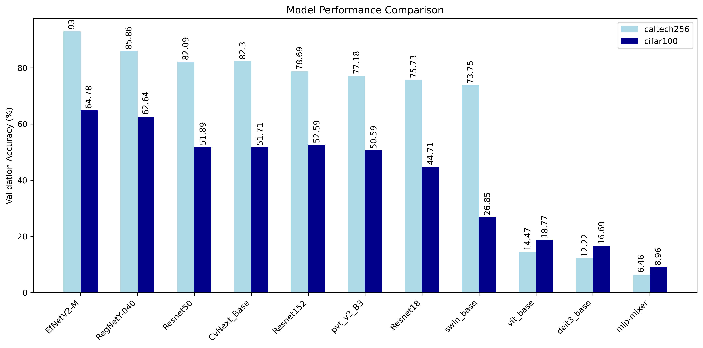

# Model Comparison on Caltech256 & Cifar100

## Project Overview

This project conducts a study of how pre-trained models perform on the task of image classification using the Caltech256 & Cifar100 dataset. We explore which model architecture inherently captures the features of these datasets most effectively, and then fine-tune these models to achieve maximum performance. The generalization capabilities of the models will then be tested on a small subset of the Open Images Dataset. 

## Motivation 

Both these datasets were picked due to their stark differences and popularity. The caltech256 emulates real-world scenarios so has more noise than the cifar100, this means images have variations in background, lighting and angle. Caltech256 also has varying image resolutions with the most common size being 640x480 in the val set for example. Whereas in cifar100 all images are 32x32 so is a controlled uniformed dataset. Therefore, by using both datasets we can understand which architectures are most suitable for different use cases.

The questions that this study tries to answer are:

- Which model architecture inherently captures features of the datasets most effectively (best feature extractor)?
- Which model demonstrates versatility across both high and low resolution images?
- How does a simple CNN perform compared to fine-tuned pre-trained models?
- How well do the models generalize to unseen data?

## Methodology

Our approach has four main experimental phases:

1.  **Linear probing**: Evaluating the feature extraction captabilities of models.
2.  **Simple fine-tuning**: Assessing how well the chosen models adapt when weights are unfrozen.
3.  **Full fine-tuning**: Maximizing performance of best model(s) from the simple fine-tuning phase. 
4. **Generalization**: Testing generalization capabilites of both pre-trained models and the simple CNN.

## Datasets

Datasets | Caltech256 | Cifar100 | Open Image subset |
|--------|------------|----------|-------------------| 
|Train: | 20,729 | 43,750 |    |
|Val:  | 2,971 | 6,250 |        |
|Test: | 6080 | 10,000 |        |
|Total: | 29,780 |  60,000 |  TODO  |

- [Link to Caltech256 dataset](https://data.caltech.edu/records/nyy15-4j048)
- [Link to Cifar100 dataset](https://www.cs.toronto.edu/~kriz/cifar.html)

## Linear Probing 

How well do models perform when weights are frozen? Removing pre-trained classifier and adding a simple linear layer instead, to use as feature extractor which is trained for 5 epochs. 

### Results

Here are the following results from the linear probing experiment.

| Model       | Caltech256 |           | Cifar100   |           |
|-------------|------------|-----------|------------|-----------|
|             | Val Acc (%) | Time (s)  | Val Acc (%) | Time (s)  |
|-------------|------------|-----------|------------|-----------|
| EfNetV2-M   | 93.00      | 1042.70   | 64.78      | 2194.13   |
| RegNetY-040 | 85.86      | 257.56    | 62.64      | 524.62    |
| Resnet50    | 82.09      | 235.95    | 51.89      | 475.19    |
| CvNext Base | 82.30      | 663.92    | 51.71      | 1388.22   |
| Resnet152   | 78.69      | 449.40    | 52.59      | 934.88    |
| PVT V2 B3   | 77.18      | 655.80    | 50.59      | 1194.28   |
| Resnet18    | 75.73      | 228.92    | 44.71      | 464.59    |
| Swin Base   | 73.75      | 841.27    | 26.85      | 1754.46   |
| Vit Base    | 14.47      | 591.13    | 18.77      | 1229.89   |
| DeiT3 Base  | 12.22      | 602.61    | 16.69      | 1253.86   |
| MLP-MIXER   | 6.46       | 488.35    | 8.96       | 1009.64   |

### Key Observations:

1. The lower resolution of cifar100 had a significant effect on model performance, eventhough it's double the size of caltech256. Therefore the feature representations extracted from caltech256 carry more information than those of cifar100, to be expected when upsampling from 32x32 to 224x224 pixels creates interpolation artifacts.
2. The top performer was EfficientNetV2 medium on both datasets with a satisfying 93.00% and 64.78%. The RegNetY-040 performs second best with 85.86% and 62.64%, a small difference of around 2% on cifar100.
3. The worst performing model is the MLP-mixer with 6.46% and 8.96% due to little inductive bias, CNNs have more relevant inductive/architectural biases therefore perform much better.
4. Transformers need to be fine-tuned on the dataset in order to be effective, the global & high level features learned are not trasferable to the new task unlike with CNN's which capture more local features.
5. Essentially any model using a convolutional mechanism for embedding instead of relying on patches perform better as features extractors.

## Simple Fine-tuning

In this next phase, a selected sub-set of models are picked to be fine-tuned based on their computational efficiency and performance. Our selection also represents the diverse architectures used in the vision domain.

Therefore following models will be selected: 

1. RegNetY-040, balance of performance and efficiency. Training time approximately 4 times shorter than efficientnet.
2. Resnet50, base cnn result.
3. mlp-mixer, mlp architecture to assess improvement when trained.
4. PVT-V2, bridges gap between cnn and transformer.
5. vit base, base vision transformer result.

Furthermore, due to the poor performance of models on cifar100, a custom CNN designed specifically for cifar100 will be trained. It uses smaller stride and kernel sizes. 
This will provide a comparative point between transfer learning and designing own models. More information on model here (make link!@!!!!)

### Results 

## Setup and Installation 

