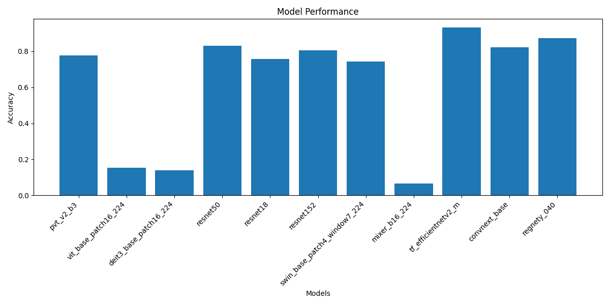

# Caltech256_classification Model Comparison

## Project Overview

This project conducts a study of how pre-trained models perform on the task of image classification for the Caltech256 dataset. We explore which model architecture inherently captures the features of the dataset most effectively, and then fine-tune certain models to achieve maximum performance.

## Motivation 

The Caltech256 dataset was picked due to the varying image resolutions and it is regarded as more of a real-world dataset. At first I wanted to use Cifar-100 and perform fine-grained image classification but I visually couldn't distinguish the images. The feature 

1.  **Linear probing**: To evaluate the feature extraction captabilities of models.
2.  **Simple fine-tuning**: Assessing how well the chosen models adapt to Caltech256 when weights are unfrozen.
3.  **Full fine-tuning**: Maximizing performance of best model from simple fine-tune.

## Linear Probing 

### Key Findings / Results

Here are the following results from the linear probing experiment.

 Model | Validation Accuracy |
|-------|--------------------------|
| PVT V2 B3 | 77.68% |
| ViT Base | 15.38% |
| DeiT3 Base | 13.93% |
| ResNet50 | 82.90% |
| ResNet18 | 75.80% |
| ResNet152 | 80.58% |
| Swin Base | 74.28% |
| MLP-Mixer | 6.73%  |
| EfficientNetV2 M  | 93.20%|
| ConvNext Base | 82.30 |
| Regnety_040 | 87.11% |

### Key Observations:

1. EfficientNetV2 was the best perfoming feature extractor with an outstanding 93.2% accuracy, the model inherently captures the features of Caltech256 best.
2. The worst performing model is the MLP-mixer with 6.73% which is normal as there is no/little inductive bias, just fully connected layers essentially.
3.  All models which use convolution for embedding  perform signicantly better than models which uses patches (vit/deit3). Therefore, the hierarchical representation of an image is vital for a feature extractor.
4. Transformers need to be fine-tuned on the dataset in order to be effective, the global & high level features learned are not trasferable to the new task unlike with CNN's which capture more local features.

## Simple Fine-tuning

The following models will be picked for the simple fine-tuning: 

1. EfficientNetV2: Best performing model (CNN)
2. MLP-Mixer: Worst model, let's see how well performs when trained.
3. PVT V2 B3: Hybrid model
4. Deit3: Transformer model.

## Setup and Installation 

